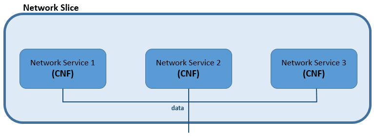

|||||
| :--- | :--- | :--- | :--- |
| __Test Case Name__ | | __slice__ | |
| __Test Purpose__ | | Intantiation & Termination processes validation of a Network Slice composed by with CNF based Network Services.| |
| __Configuration__ | | A Network Slice contains 3 CNF based Network Services interconnected among them by 5 Virtual Links. The test uses a Network Slice Templated descriptor (NSTd) wich defines the Network Slice to instantiate and terminate.| |
| __Test Tool__ | | | |
| __Metric__ | | | |
| __References__ | | https://github.com/sonata-nfv/tng-slice-mngr | |
| __Applicability__ | | | |
| __Pre-test conditions__ | | |
| __Test sequence__ | Step | Description | Result |
| | 1 | Setting Up Test Environment | Prepares the environemtn information to be used during the test. |
| | 2 | Remove Previously Used Packages | Remove any possible package left from other tests. |
| | 3 | Service Package On-Boarding | Service (NSs and CNFs) package is on-boarded in SP catalog. |
| | 4 | Network Slice Template On-Boarding  | Network Slice Template descriptor is on-boarded in SP catalog. |
| | 5 | Network Slice Instantiation | An instantiation request reaches the Network Slice Manager throught the GTK and starts the intra-process requests: creates the NSIr, slice-vld creation, NSs instances. |
| | 6 | Validates Instantiation Process | Validates if all the process is well-done by checking the status (INSTANTIATED) of the slice instantiation request. |
| | 7 | Network Slice Termination | A termination request reaches the Network Slice Manager throught the GTK and starts all the intra-process requests: terminate all NSs and remove slice-VLDs. |
| | 8 | Validate Termination Process | Validates if all the process is well-done by checking the status (TERMINATED) of the slice termination request. |
| | 9 | Remove Network Slice Template | Deletes the NST descriptor previously on-boarded in order to leave the environment clean for other tests. |
| | 10 | Remove Service Package | Deletes the service package previously on-boarded in order to leave the environment clean for other tests. |
| __Test Verdict__ | | If no error appeared in all actions and the NSIr finishes with its status and those of the NS instances as "Terminated".|
| __Additional resources__ | | | |
# Scenario

# Test flow
