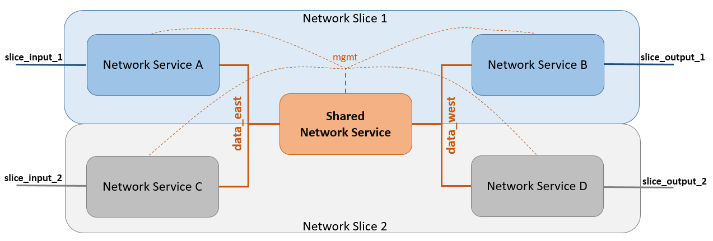
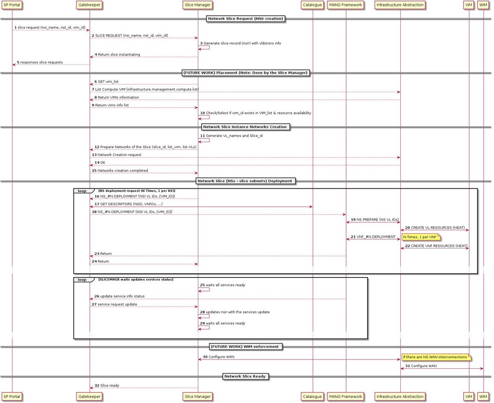

|||||
| :--- | :--- | :--- | :--- |
| __Test Case Name__ | | __slice__ | |
| __Test Purpose__ | | Validate the process to instantiate & terminate 2 Network Slices Instances based on the same Networks Slice Template with one shared NS. | |
| __Configuration__ | | The test uses the same Network Slice Templated descriptor (NSTd) to instantiate and terminate two Network Slice Instances (NSIs). Each NSI contains 3 Network Services (NSs) interconnected among them by 5 Virtual Links. Each NS contains a single VNF and one of the three NSs is shared among the two Network Slice Instances.| |
| __Test Tool__ | | | |
| __Metric__ | | | |
| __References__ | | https://github.com/sonata-nfv/tng-slice-mngr | |
| __Applicability__ | | | |
| __Pre-test conditions__ | | | |
| __Test sequence__ | Step | Description | Result |
| | 1 | Setting Up Test Environment | Prepares the environment information to be used during the test. |
| | 2 | Remove Previously Used Packages | Remove any possible package left from other tests. |
| | 3 | Service Package On-Boarding | Service (NSs and VNFs) package is on-boarded in SP catalog. |
| | 4 | Network Slice Template On-Boarding | A Network Slice Template descriptor with one shared NS is on-boarded in SP catalog. |
| | 5 | First Network Slice Instantiation | An instantiation request reaches the Network Slice Manager throught the GTK and starts the intra-process requests: creates the NSIr, slice-vld creation (5), NSs instances. |
| | 6 | Validates First Instantiation Process | Validates if all the process is well-done by checking the status (INSTANTIATED) of the slice instantiation request. |
| | 7 | Second Network Slice Instantiation | An instantiation request reaches the Network Slice Manager throught the GTK and starts the intra-process requests: creates the NSIr, slice-vld creation (only those not shared), NSs instances (only those not shared). |
| | 8 | Validates Second Instantiation Process | Validates if all the process is well-done by checking the status (INSTANTIATED) of the slice instantiation request. |
| | 9 | First Network Slice Termination | A termination request reaches the Network Slice Manager throught the GTK and starts all the intra-process requests: terminate  NSs and remove slice-VLDs, only those NOT SHARED. |
| | 10 | Validate First Termination Process | Validates if all the process is well-done by checking the status (TERMINATED) of the slice termination request. |
| | 11 | Second Network Slice Termination | A termination request reaches the Network Slice Manager throught the GTK and starts all the intra-process requests: terminate NSs and remove slice-VLDs, including the SHARED resources. |
| | 12 | Validate Second Termination Process | Validates if all the process is well-done by checking the status (TERMINATED) of the slice termination request. |
| | 13 | Remove Network Slice Template | Deletes the NST descriptor previously on-boarded in order to leave the environment clean for other tests. |
| | 14 | Remove Service Package | Deletes the service package previously on-boarded in order to leave the environment clean for other tests. |
| __Test Verdict__ | | If no error appeared in all actions and the NSIr finishes with its status and those of the NS instances as "Terminated".|
| __Additional resources__ | | | |
# Scenario

# Test flow

