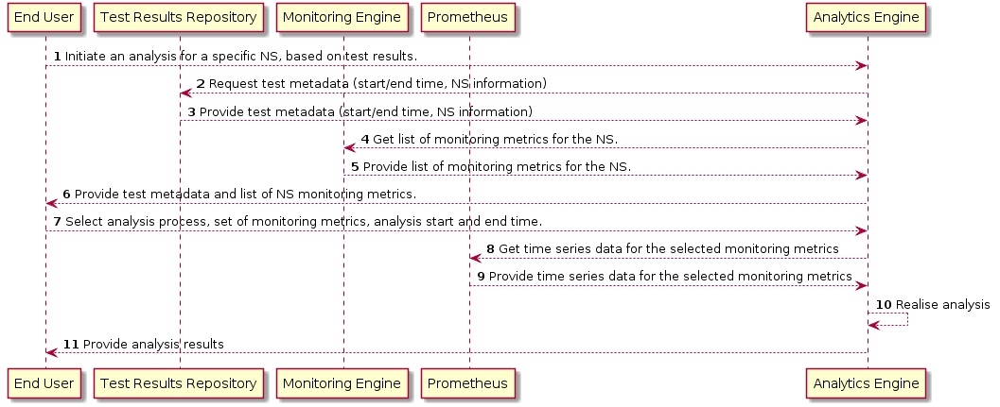

|||||
| :--- | :--- | :--- | :--- |
| __Test Case Name__ | | __Analyze Immersive Media Pilot Streaming Monitoring Metrics__ | |
| __Test Purpose__ | | Check that analytics engine is correctly integrated at VnV environment.| |
| __Configuration__ | | A NS composed by three VNFs (CMS, MA, MSE) is deployed on the Service Platform. A defined test plan has been executed prior to this test and is completed succesfully| |
| __Test Tool__ | | robot framework| |
| __References__ | | https://github.com/sonata-nfv/tng-analytics-engine/ | |
| __Applicability__ | | Variations of this test case can be performed by modifying the requested Analytic Service| |
| __Pre-test conditions__ | | A sucsesfull VnV test has to executed prior to the the analytics engine invocation| |
| __Test sequence__ | Step | Description | Result |
| | 1 | Fetch Results of latest Test succesfull execution | Fetch Results of latest Test succesfull execution from test results repository|
| | 2 | Fetch All Available Analytic Services | Fetch All Available Analytic Services|
| | 3 | Invoke a test analytic process | Identify test metrics that have a significant rate fluctuation. Report basic statistics about health of VnV test data results|
| | 4 | Check Analytic results	 | Check the resuts generated by the analytic process execution|

| __Additional resources__ | | | |

# Test flow

